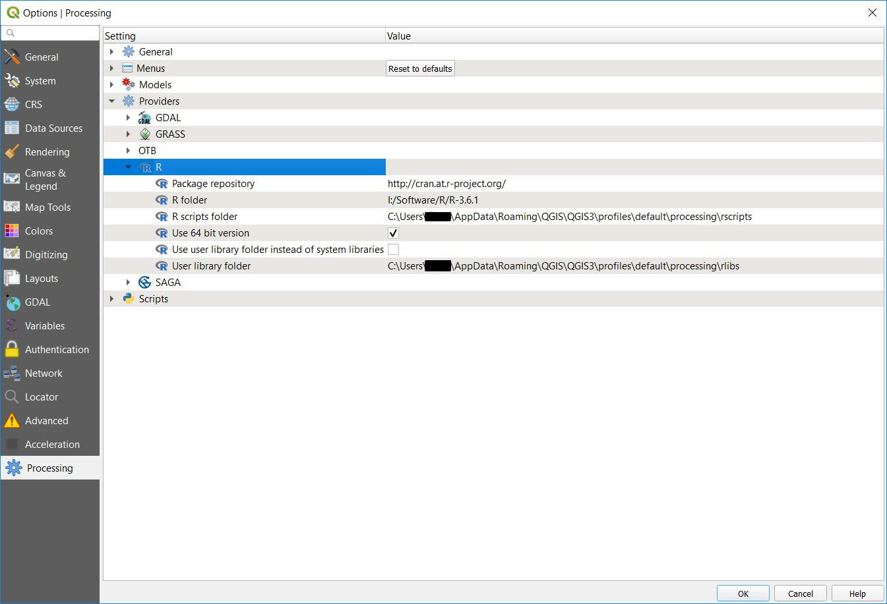

# Processing R Provider

Processing provider for R scripts plugin for [QGIS](https://www.qgis.org/en/site/). The plugin allows execution of R scripts directly from QGIS on data loaded in QGIS.

## Instalation

The plugin is available QGIS Python Plugins Repository [here](https://plugins.qgis.org/plugins/processing_r/). It can also be installed directly from QGIS via the **Plugins** tool.

Building from source for offline install can be done by downloading the [source code](https://github.com/north-road/qgis-processing-r) and running command:
```
make zip
```
in the main directory. The produced zip file can then be installed in QGIS from **Plugins** tool in the **Install from zip** window.

## R

[R](https://www.r-project.org) is a free and open-source software environment for statistical computing and graphics.

It has to be installed separately ([Download and Install R](https://cran.r-project.org/)), together with a few necessary libraries.

The beauty of Processing implementation is that you can add your scripts, simple or complex ones, and they may then be used as any other module, piped into more complex workflows, etc.

Test some of the preinstalled examples, if you have [R](https://www.r-project.org) already installed.

## Settings for the plugin

### Linux 

On Linux, the toolbox should find system installation of R on its own.

### Windows

If R is installed in the expected path (e.g. "C:\PROGRAM FILES\R\"), the plugin tries to detect the R installation automatically. Otherwise, it is necessary to set the setting "R folder" to the correct folder, as seen on the image. The correct folder is the one under which folders "bin", "doc", "etc" and others exist. Generally, it is a folder that has R's version in its name.   


